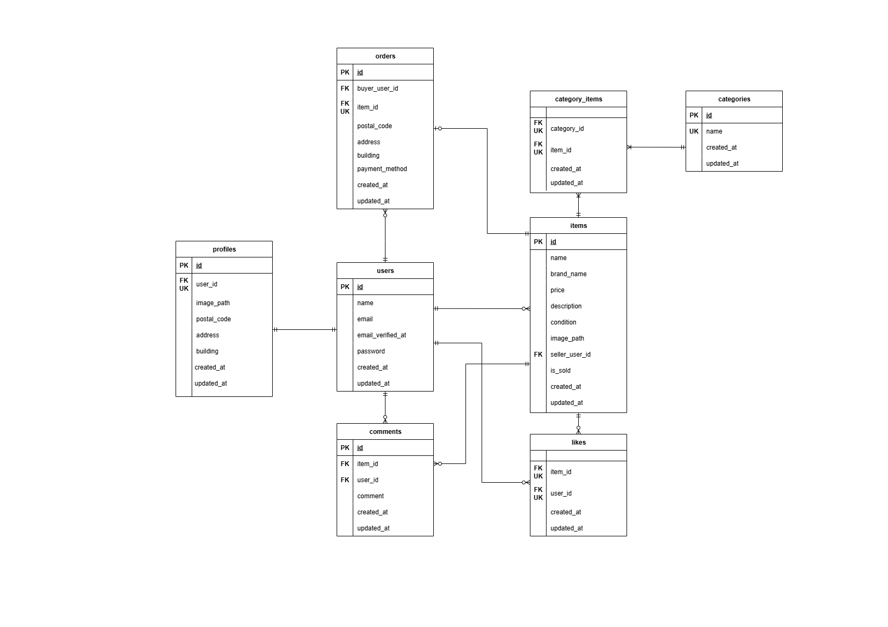

# coachtechフリマ
提出タグ: submission-2025-11-08-01-07

## 環境構築手順

### 1. Docker ビルド
```bash
git clone https://github.com/koshikawa-minori/coachtech-fleamarket.git
docker-compose up -d --build
```

### 2. Laravel 環境構築
```bash
docker-compose exec php bash
composer install
cp .env.example .env  #環境変数を変更
```
- DB 接続情報（docker-compose.yml の設定と一致させる）

- キャッシュ設定（デフォルト database だとエラーになるため file に変更する）

```bash
php artisan key:generate
php artisan migrate
php artisan db:seed
php artisan storage:link  #画像表示のために必要
```

## 使用技術（実行環境）
- PHP 8.x
- Laravel 12.x
- MySQL 8.0
- nginx 1.21

## ER図


## 開発環境URL
- 開発環境: http://localhost/
- phpMyAdmin: http://localhost:8080/
- 会員登録: http://localhost/register
- ログイン: http://localhost/login

## テストユーザー情報

| ユーザー種別 | メールアドレス | パスワード |
|---------------|----------------|-------------|
| 一般ユーザー | test@example.com | password |

※本アプリではメール認証を実装しています。
シードユーザー（test@example.com）は未認証のため、
ログイン前にメール認証を完了させてください。

## Stripe決済機能（応用）

- 「カード支払い」を選択して「購入する」ボタンを押下すると、
  Stripeの決済画面へ遷移し、決済が可能です。
  決済完了後、購入済み商品は一覧に「Sold」として表示されます。
- 「コンビニ支払い」を選択した場合は「購入する」ボタンを押下すると、購入処理を完了します。※この処理はコーチ確認済みです。

## メール認証機能（応用）

本アプリでは**Mailtrap**を利用して
新規会員登録時にメール認証を行います。

### メール認証手順

1. `.env` に Mailtrap の `MAIL_USERNAME` / `MAIL_PASSWORD` を設定
2. `/register`（会員登録画面）で新規登録を行う
3. 登録直後に認証メールを送信し、 `/register/verify`（メール認証誘導画面）へ遷移
4. 「認証はこちらから」ボタン押下で`/email/verify`（メール認証画面）へ遷移
5. 認証メール内のリンクをクリックすると、
  新しいタブで `/email/verify/{id}/{hash}` にアクセスし認証完了、その後プロフィール設定画面が開く

- 認証が未完了のままログインした場合も認証誘導画面へ遷移
- 認証メールの再送機能あり（1分間に6回まで）

## テストコード

- **PHPUnit** を用いた Feature テストを実装しています。
- テスト実行時は、**Docker 上の MySQL テスト用データベース（coachtech_fleamarket_test）** を使用します。
- テスト用データベースは **MySQL コンテナ起動時に自動作成**されます。
- テスト用の DB 接続設定および APP_KEY は **phpunit.xml** にて定義しています。

### テスト実行前の準備

```bash
# DB を含めて初期化（初回 or 作り直し時）
docker-compose down -v
docker-compose up -d --build

# 開発用DBのマイグレーション
docker-compose exec php php artisan migrate --seed
```

### テスト実行方法
以下のどちらかのコマンドで
すべてのFeatureテストを実行できます。

※ 環境によっては phpunit コマンドの使用を推奨します。

#### Laravel の Artisan コマンドを利用
```bash
docker-compose exec php php artisan test
```
#### PHPUnit コマンドを利用
```bash
docker-compose exec php ./vendor/bin/phpunit
```

## フロントエンド補足

- JavaScriptは購入画面での動的処理（支払い方法選択時の小計反映など）に限定して使用しています。

  ※この処理はコーチ確認済みです。

- 主要なバリデーションや画面制御はすべてLaravel側で実装しています。
