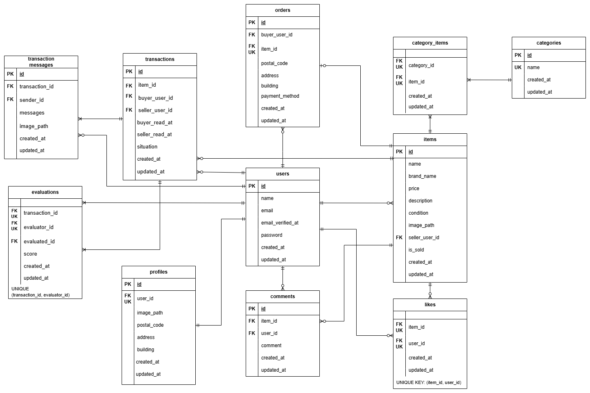

# coachtechフリマ
提出タグ: submission-20260217

## 概要
本アプリケーションは、出品・購入・いいね・コメント・プロフィール管理ができるフリマアプリです。  
未認証ユーザーは商品閲覧のみ可能で、認証ユーザーは出品・購入・いいね・コメント・プロフィール編集が可能です。  
商品購入後、取引チャットを通じて出品者とやり取りが可能です。
取引完了後は相互評価を行い、評価の平均がマイページに表示されます。

## 使用技術（実行環境）
- Laravel 12.x
- PHP 8.2+
- MySQL 8.0
- nginx 1.25

## 機能一覧

### 認証機能
- 会員登録 / ログイン / ログアウト（Fortify）
- メール認証機能（Mailtrap、応用）
- メール認証再送機能

### 商品関連
- 商品一覧表示（おすすめ）
- マイリスト表示（いいねした商品）
- 商品検索（商品名の部分一致検索）
- 商品詳細表示
- 商品出品（カテゴリ複数選択、画像アップロード）
- 商品購入
- 購入済み商品の Sold 表示

### ユーザー操作
- いいね追加 / 解除
- コメント投稿（255文字以内）
- マイページ表示
  - 出品した商品一覧
  - 購入した商品一覧
  - 取引中の商品一覧
- プロフィール編集
  - プロフィール画像
  - ユーザー名
  - 郵便番号 / 住所 / 建物名

### 決済・配送
- 支払い方法選択
  - コンビニ支払い
  - カード支払い（Stripe）
- 配送先住所変更機能

### 取引機能
- チャット機能(投稿・閲覧・編集・削除)
- 相互評価機能
- 評価平均表示（マイページ）

## 開発環境URL
- アプリトップ: http://localhost/
- phpMyAdmin: http://localhost:8080/
- 会員登録: http://localhost/register
- ログイン: http://localhost/login
- マイページ（要ログイン）: http://localhost/mypage
- 取引チャットは以下のURLから確認できます（要ログイン）

例: http://localhost/transaction/1

## 環境構築手順

### 1. Docker ビルド
```bash
git clone https://github.com/koshikawa-minori/coachtech-fleamarket.git
docker-compose up -d --build
```

### 2. Laravel 環境構築
```bash
docker-compose exec php bash
composer install
cp .env.example .env  #環境変数を変更
```
- DB 接続情報はdocker-compose.yml の設定と一致させてください。

- キャッシュ設定は.env の CACHE_DRIVER を file に変更してください。

```bash
php artisan key:generate
php artisan migrate:fresh --seed  #ダミーデータ・取引データ・評価データを含めて再現可能
php artisan storage:link  #画像表示のために必要
```

### ダミー取引データについて
以下の取引データを Seeder にて登録しています。
- HDD（進行中・取引チャット有）
- タンブラー（進行中・取引チャット無）
- コーヒーミル（購入者完了・取引チャット有）
- ノートPC（完了：双方評価済）

購入者は test@example.com です。

取引チャットはメッセージの並び順・未読判定の確認が可能です。

## ER図


## テーブル仕様（抜粋）

本アプリの主要テーブル構成です。  
全カラムの網羅ではなく、初見でDBの全体像が把握できる粒度で記載しています。

### users
- 役割：ユーザー情報
- 主なカラム：
  - `id` (PK)
  - `name`
  - `email`
  - `email_verified_at`(メール認証)
  - `password`

### profiles
- 役割：プロフィール情報(住所・建物名・画像など)
- 主なカラム：
  - `id` (PK)
  - `user_id` (FK → users.id)
  - `image_path`（プロフィール画像）
  - `postal_code`
  - `address`
  - `building`

### items
- 役割：商品情報（出品）
- 主なカラム：
  - `id` (PK)
  - `seller_user_id` (FK → users.id)(出品者)
  - `name`
  - `brand_name`
  - `description`
  - `price`
  - `condition`
  - `image_path`
  - `is_sold`(売却判定)
- 補足：
  - カテゴリは items では保持せず、`category_items` で管理

### comments
- 役割：商品へのコメント
- 主なカラム：
  - `id` (PK)
  - `user_id` (FK → users.id)
  - `item_id` (FK → items.id)
  - `comment`

### orders
- 役割：購入情報(購入者・配送先・支払い方法)
- 主なカラム：
  - `id` (PK)
  - `buyer_user_id` (FK → users.id)(購入者)
  - `item_id` (FK → items.id)
  - `postal_code`
  - `address`
  - `building`
  - `payment_method`
- 制約：
  - `item_id` をユニーク(1商品につき1購入)

### categories
- 役割：カテゴリ
- 主なカラム：
  - `id` (PK)
  - `name`

### category_items
- 役割：商品とカテゴリの紐付け
- 主なカラム：
  - `category_id` (FK → categories.id)
  - `item_id` (FK → items.id)
- 制約：
  - `category_id` + `item_id` をユニーク(重複防止)

### likes
- 役割：いいね
- 主なカラム：
  - `user_id` (FK → users.id)
  - `item_id` (FK → items.id)
- 制約：
  - `user_id` + `item_id` をユニーク(重複防止)

※ 詳細は `database/migrations` を参照してください。

### transactions
- 役割：取引
- 主なカラム：
  - `id` (PK)
  - `item_id` (FK → items.id)
  - `buyer_user_id` (FK → users.id)
  - `seller_user_id` (FK → users.id)
  - `buyer_read_at`
  - `seller_read_at`
  - `situation`
- 制約：
  - UNIQUE KEY: (item_id) ※1商品1取引を保証
- 補足：
  - 未読件数は `*_read_at` 以降のメッセージ件数で判定する
- situation の値
  - 1: 進行中
  - 2: 購入者完了
  - 3: 双方完了（取引終了）

### transaction_messages
- 役割：取引チャット
- 主なカラム：
  - `id` (PK)
  - `transaction_id` (FK → transactions.id)
  - `sender_id` (FK → users.id)
  - `message`
  - `image_path`
- 補足：
 - テキスト入力時のみ任意で画像添付可

### evaluations
- 役割：取引完了後の相互評価
- 主なカラム：
  - `id` (PK)
  - `transaction_id` (FK → transactions.id)
  - `evaluator_id` (FK → users.id)
  - `evaluated_id` (FK → users.id)
  - `score`
- 制約：
  - UNIQUE KEY: (`transaction_id`, `evaluator_id`) ※評価重複防止

## テストユーザー情報

| ユーザー種別 | メールアドレス | パスワード |
|---|---|---|
| 一般ユーザー | test@example.com | password |
| 購入者  | buyer@example.com | password |
| 出品者 | seller@example.com | password |
| 出品者2 | seller2@example.com | password |

- 本アプリではメール認証を実装しています。
- 上記ユーザーは、動作確認用として **メール認証済み（email_verified_at 設定済み）** の状態で作成されています。

## Stripe決済機能

- 「カード支払い」を選択して「購入する」ボタンを押下すると、
  Stripeの決済画面へ遷移し、決済が可能です。
  決済完了後、購入済み商品は一覧に「Sold」として表示されます。
- 「コンビニ支払い」を選択した場合は「購入する」ボタンを押下すると、購入処理を完了します。  
※この処理はコーチ確認済みです。

## メール機能

本アプリでは**Mailtrap**を利用して新規会員登録時のメール認証および  
取引完了時の通知メール送信を行っています。

### Mailtrap設定（環境変数）

`.env` に以下を設定してください。
- MAIL_USERNAME
- MAIL_PASSWORD

### メール認証手順

1. `/register`（会員登録画面）で新規登録を行う
2. 登録直後に認証メールを送信し、 `/register/verify`（メール認証誘導画面）へ遷移
3. 「認証はこちらから」ボタン押下で`/email/verify`（メール認証画面）へ遷移
4. 認証メール内のリンクをクリックすると、
  新しいタブで `/email/verify/{id}/{hash}` にアクセスし認証完了、その後プロフィール設定画面が開く

- 認証が未完了のままログインした場合も認証誘導画面へ遷移
- 認証メールの再送機能あり（1分間に6回まで）
- Mailtrapの無料プランには送信レート制限があるため、送信エラーが発生する場合があります。
- Mailtrap の送信制限等で確認が難しい場合は、  
  `.env` を `MAIL_MAILER=log` に切り替えることで  
  `storage/logs/laravel.log` に出力される認証URLから動作確認できます。

### 通知メール確認手順

1. test@example.com（購入者）でログイン
2. 取引完了ボタンを押下
3. 出品者宛に通知メールが送信されることを確認

## テストコード

- **PHPUnit** を用いた Feature テストを実装しています。
- テスト実行時は、**Docker 上の MySQL テスト用データベース（coachtech_fleamarket_test）** を使用します。
- テスト用データベースは **MySQL コンテナ起動時に自動作成**されます。
- テスト用の DB 接続設定は **phpunit.xml** に定義しており、APP_KEY は **.env.testing** を参照してテストを実行します。

### テスト実行前の準備

```bash
# DB を含めて初期化（初回 or 作り直し時）
docker-compose down -v
docker-compose up -d --build

# 開発用DBのマイグレーション
docker-compose exec php php artisan migrate --seed
```

### テスト実行方法
以下のどちらかのコマンドで
すべてのFeatureテストを実行できます。

※ 環境によっては phpunit コマンドの使用を推奨します。

#### Laravel の Artisan コマンドを利用
```bash
docker-compose exec php php artisan test
```
#### PHPUnit コマンドを利用
```bash
docker-compose exec php ./vendor/bin/phpunit
```

## フロントエンド補足

- JavaScriptは購入画面での動的処理（支払い方法選択時の小計反映など）に限定して使用しています。

  ※この処理はコーチ確認済みです。

- 主要なバリデーションや画面制御はすべてLaravel側で実装しています。
